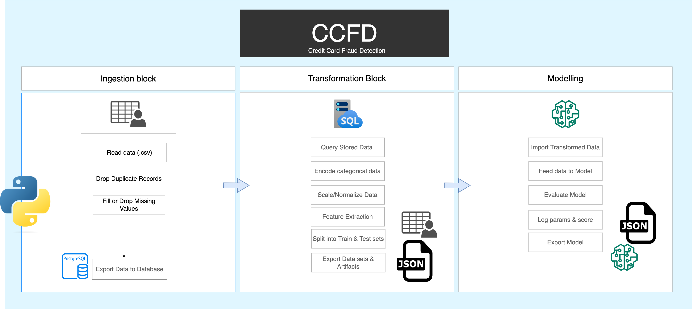
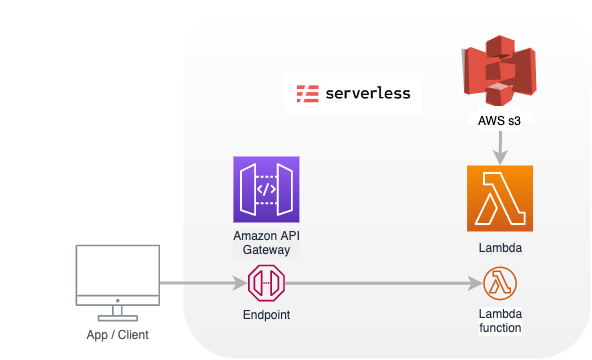

# credit-card-fraud-detection-ai

## Problem Statement 

Fighting fraud with state-of-the-art technology.

Credit card fraud is a major challenge for many businesses, causing substantial and growing
financial losses every year.
According to the UK-2022 annual fraud report1:

- Unauthorised financial fraud losses across payment cards, remote banking and cheques totalled £730.4 million in 2021.
- Banks and card companies prevented £1.4 billion in unauthorised fraud in 2021.
- UK Finance members reported 195,996 incidents of Authorised Push Payment (APP) scams in 2021 with gross losses of £583.2 million.

Detecting fraud patterns in payment card transactions is a challenging problem. With the ever-growing amount of data generated by payment card transactions, it has become impossible for a human analyst to detect fraudulent patterns in transaction datasets, often characterized by a large number of samples, many dimensions, and online updates. As a result, the design of payment card fraud detection techniques has increasingly focused in the last decade on approaches based on machine learning (ML) techniques that automate the process of identifying fraudulent patterns from large volumes of data.

## Development Structure

## Model Consumption Flow

The model is deployed on aws sagemaker and consumed via an api provided by aws api gateway.

 
